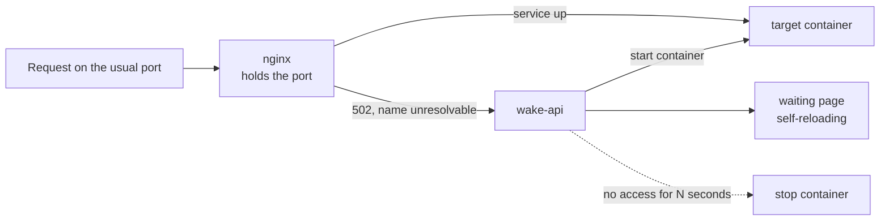

# wake-gateway

Rarely used web services do not need to run all day. This gateway holds their
published ports on their behalf: while a service sleeps, the first request
starts it and the visitor gets a waiting page that reloads itself; after a
period of no access, the service goes back to sleep.

## The idea

Nothing about the way the service is reached changes. Same host, same port,
same bookmark. The gateway takes over the port publication, the target
container publishes nothing itself and sits at `restart: "no"`, so its lifecycle
belongs to the gateway alone. Reverse proxies and tunnels in front stay
untouched, which is the point: turning a service into an on-demand one should
not ripple outward.

Idle detection reads each service's own nginx access log rather than asking the
container. A request that was served is the only evidence of use that cannot lie.

## One trap worth naming

An availability check that probes the service *is* a wake signal. Point your
monitoring at a normal endpoint and you will keep every sleeping service awake
around the clock, while the graphs look perfectly healthy. So the gateway serves
`/_wake_health` on every port: it always answers, it never starts anything, and
it does not count as use.

Related: a request source list that suppresses waking sounds tempting for
monitoring, but the same address usually carries real traffic too. The health
path solves it without cutting anyone off.

## Layout

- `app/main.py` — the API: wake, sleep, status, and the reaper that puts idle
  services back to sleep.
- `app/render_nginx.py` — renders the nginx configuration from the registry at
  startup, so there is exactly one source of truth. Adding a service is an entry
  in a JSON file, not a code change.
- `services.example.json` — the registry format: container, upstream, the port
  to hold, idle timeout, and companion containers such as a database that must
  start before and stop after the service itself.
- `docker-compose.example.yml` — the arrangement, including a Docker socket
  proxy restricted to viewing, starting and stopping containers. No exec, no
  build, no restart.

MIT licensed.

## About this snapshot

The registry of the actual services and the compose file that wires them into
their networks stayed behind, since together they amount to an inventory of what
runs here. The example files next to them carry the same shape.

One commit, because the history stays private. The gateway runs at home in front
of real services, and the ports it holds are the ones I use myself.
